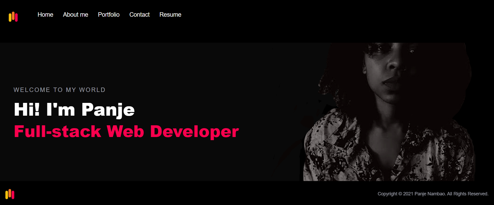
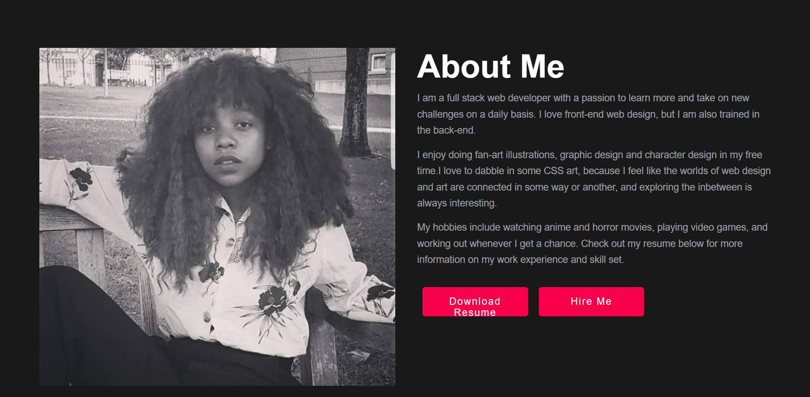
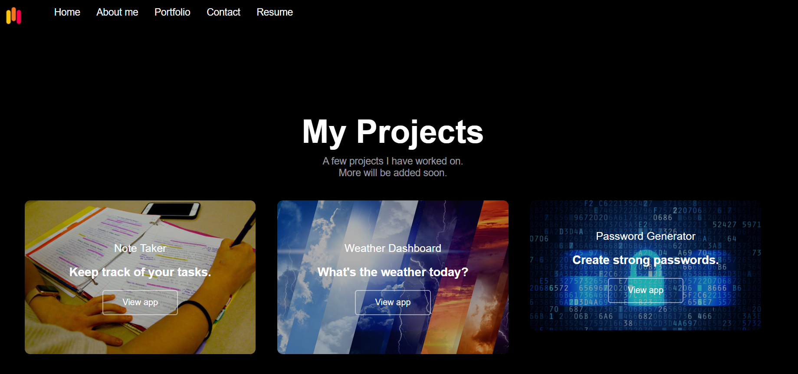

# Panje-Nambao-Portfolio

I made a simple portfolio using react.js and node.js.
I utilized the Browser-Router add-on to create simple routes that allow the user to navigate from one page to another.
I also added a resume that can be downloaded. 
As of now, my resume is still in-progress, but I just wanted to make sure the download button and functionality of it is working to ensure that the pdf can be downloaded.
I hope to make improvements to it soon. 

# Video Demos

Here is a demonstration of how the app works on the gh-pages and on my local machine

[Demo Before fixing the landing page issue](https://watch.screencastify.com/v/W3K31aLsYbOVFutw1ZeI)

[Demo: Fixed landing page issue](https://watch.screencastify.com/v/71w2wx2wyRDTeyqAzige)

# Screenshots of some portfolio pages

